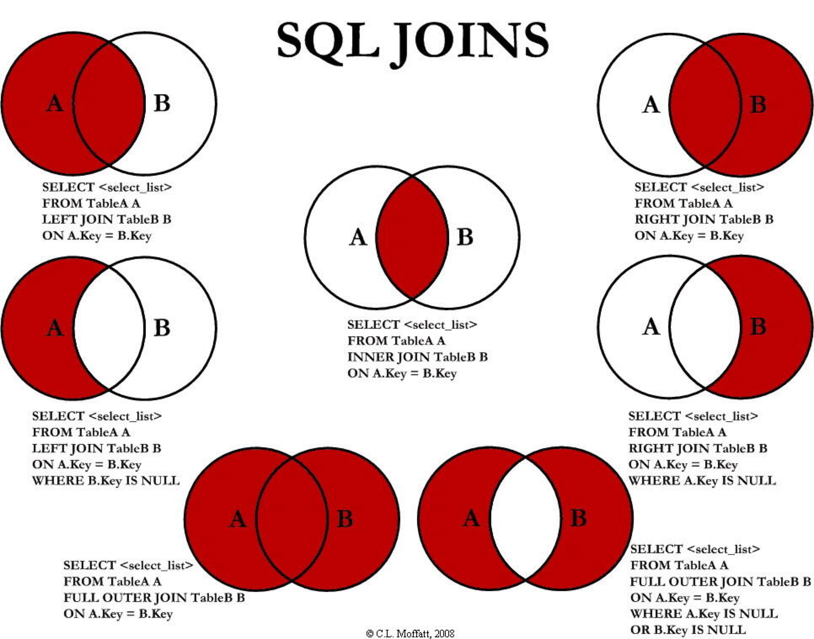

# MySQL
## 概念
### 主键

### 外键

### 表关联
left join,right join,inner join, outer join



### 并发与锁
数据库的索，和逻辑锁(乐观锁之类的)

### 事务

### 视图(View)

### 临时表

## 数据类型
* 数字
  * 整数
    * TINYINT 1字节。 用来存整数或布尔型的值。
    * INT 4字节。 自增id 用 INT(11) 够了。
    * BIGINT
  * 小数
    * FLOAT 4字节
    * DOUBLE 8字节
    * DECIMAL 精度控制
* 日期
  * DATE 格式：YYYY-MM-DD 日期。
  * TIME 格式：HH:MM:SS 时间。
  * DATETIME 格式: YYYY-MM-DD HH:MM:SS 日期+时间。
  * TIMESTAMP 距1970的时间戳。
* 字符串
  * CHAR 定长字符串
  * VARCHAR 变长字符串。 小系统，就选这个吧。 varchar(1) 可以放2个中文字 
  * TEXT 长文本数据

## 表设计
一对一  
一个学生有一个身份证信息。 学生表有个身份证ID。

一对多
一个班主任管理多个学生。 学生表存班主任ID。 

多对多
一个学生有多个课程，一个课程对应多个学生。 用一个关联表，有学生ID和课程ID的字段。

## 表设计工具
* [PDMan](https://gitee.com/robergroup/pdman) 是一款开源免费的数据库模型建模工具，支持Windows,Mac,Linux等操作系统，是PowerDesigner之外，更好的免费的替代方案。
* [Power Designer](https://baike.baidu.com/item/power%20designer/2482290) 收费。

## Workbench 做表设计
### 新建ERR图
File -> New Model。

### 导出做好的ERR图为SQL语句
可以用，在 ERR 图那Tab： 
方法1: Tools -> Objects -> Copy SQL to copyboard。

方法2: File -> Export 按步骤走完。

### 将现有的数据库生成EER图
Database->Reverse Engineer 。然后一路continue，在 Select Schemas 选择要生成 EER图 的数据库， 一路 continue 就可以了~


## SQL
### 查找
搜索是 SQL 最复杂的。 

书写顺序: 
```
select [distinct] 字段 
from 表名 
  join
where
group by
order by
limit
```

更多见 [常用 SQL](common.md)

### 更新
```
update 表名 
set 字段 = '值'
where ;
```

### 删除
```
delete from 表名
where
```

或

`truncate`

## 其他
游标  
视图

## 系统函数
* `now()` 当前时间
* `TIMESTAMPDIFF(MINUTE, now(),'2019-4-9 14:25:00')` 时间比较。第一个是单位：支持 SECOND(秒), MINUTE(分), HOUR(小时), DAY(天), MONTH(月), YEAR(年)。返回值是后面的时间减前面的值。
* `count(DISTINCT 字段)` 数量。`DISTINCT` 用来去重。
* `sum(字段)` 求和。
* 字符串操作
  * `concat(字符串1, 字符串2...)`  字段可以是表名。如 `select concat('update set name=a from xxx where id = ', id)`
  * `replace`

## 数据导入
1. 创建个临时表。
1. 用 NaviCat 的导入向导。
1. 从 `excel` 文件中 导入数据。将 `excel` 的列对应到临时表的列。

导入新的数据，覆盖以前以前老的值：
查询：  
```
select t1.no, t1.price * 100, t2.no, t2.price from temp_sku as t1
inner join sku as t2
  on t1.no = t2.no
  and t1.price * 100 <> t2.price;
```

更新
```
update temp_sku as t1, sku as t2
  set t2.price = t1.price * 100
where t1.no = t2.no and t1.price * 100 <> t2.price
```

## 运行
1. cd /usr/local/bin
2. mysql.server start

查看密码的的查看方式 `http://www.jb51.net/article/101945.htm`

## 重启
1. cd /usr/local/bin
2. mysql.server restart

## 教程
* [菜鸟教程](http://www.runoob.com/mysql/mysql-tutorial.html)


