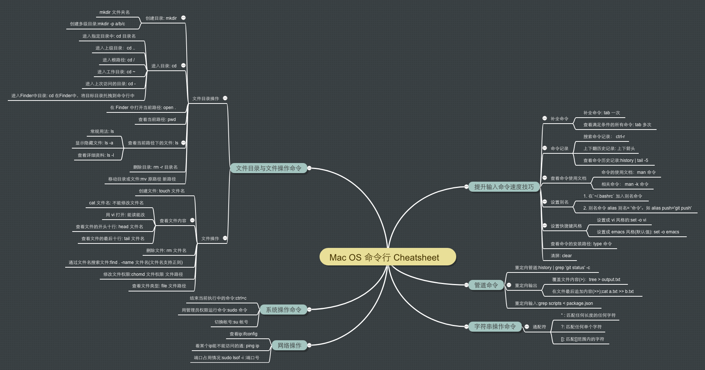

# 熟练使用 Mac OS 命令行，提高程序员生产力，只需掌握这6组命令和技巧


熟练使用命令行是常常被忽视的技能。但实际上，熟练使用命令行很重要。主要有2个原因：
* 熟练使用命令行是程序员的必备技能。做有些任务必须用到命令行。以前端程序员为例，启动项目，停止项目，构建项目都需要命令行。
* 熟练掌握命令行能提高程序员的生产力。如：在`/GitHub/note` 下创建文件夹 `test`，用命令行只需要输入 `cd /GitHub/note && mkdir test`，用图像界面需要点击两次鼠标到 `/GitHub/note` 下，右击 `新建文件夹` 再键入内容。

命令行支持上千条命令，本文只选了常用的6组命令和技巧：提升输入命令速度技巧，文件夹与文件操作命令，管道命令，网络命令，字符串操作命令，系统操作命令。

注意：本文介绍的命令记针对的是 Mac OS 系统。

## 第1组 提升输入命令速度技巧
### 补全命令
按 tab 键可以补全命令和文件路径。如果按 tab 啥都没发生，表示有超过一个命令或路径满足当前的输入内容，连按两下 tab 查看满足条件的所有命令。

### 命令记录
输入 ctrl+r 搜索命令记录。

用上下箭头翻阅命令历史记录。输入上箭头键，显示最近一条执行的命令。按多次上箭头键，看更久的命令。下箭头与上箭头的功能相反。

用 histroy 查看命令历史记录。 如查看最近的5条的命令为:
```bash
history | tail -5
```

### 查看命令使用文档
用 `man` 命令来查看某个命令的使用文档。如:
```bash
man ls # 查看ls命令文档
man -k ls # 搜索的ls相关的命令
```

推荐使用在线工具[explainshell](https://explainshell.com/)来看命令的文档。

### 设置别名
用`alias`来查看和设置别名。通过设置别名，可以很长或难记的命令，变成自定义的别名。例如: `grep` 可以加参数 `--color=auto` 实现搜索结果中高亮显示搜索字符串的功能。但每次使用 `grep` 都得要自行加上 `--color=auto` 又显的很麻烦，可以在`~/.bashrc`中加入下面的命令来设置别名：
``` bash
alias grep='grep --color=auto'
```

然后，执行下面的命令使别名生效。
``` bash
source ~/.bashrc
```

这边是我设置的别名:
```bash
# npm 相关
alias build='npm run build'
alias dev='npm run dev'
alias ni='npm install'
alias yi='yarn install'
# git 相关。git 自身也支持别名。
alias pull='git pull'
alias push='git push'
# 其他
alias grep='grep --color=auto'
```

直接执行 `alias` 可以查看目前设置的所有的的别名。

### 设置快捷键分割
命令行默认用的是 Emacs 的快捷键。光标移动，删除内容都可以用 Emacs 的快捷键。如：ctrl+a 可以将光标移至行首，ctrl+e 可以将光标移至行尾，ctrl+k 可以删除光标至行尾的所有内容，ctrl+u 可以删除行内光标所在位置之前的内容。

执行下面的命令，可以设置成 vi 风格的快捷键。
``` bash
set -o vi
```

改回来
``` bash
set -o emacs
```

### 查看命令的安装路径
可以用命令 `type` 来查看命令的安装路径。如
```bash
type which # 命令输出: which is /usr/bin/which
```

也可以用 `type` 看当前系统中是否有某个命令。如
```bash
type aaaa # 命令输出 -bash: type: aaaa: not found
```

感兴趣的可以了解下 `which` 命令。它和 `type` 命令很类似。

### 清屏
可以用命令 `clear` 来清屏。

### 输出内容
可以用命令 `echo` 来输出内容。如
```bash
echo 内容`date +%H:%M:%S`
```

如果要输出命令的运行结果，用 \`\` 来包住命令。如:
``` bash
echo `date +%H:%M:%S` 早吃饭。 # 输出： 09:20:13 早吃饭。
```

## 第2组，最常用的命令： 文件目录与文件操作命令
### 文件目录操作
#### 创建
用 `mkdir` 创建目录。
```bash
mkdir 目录名
mkdir -p a/b/c # 创建多级目录
```

#### 进入目录
用 `cd` 命令来进入目录。很多命令必须进入指定目录才能执行。比如，需要进入`package.json`所在的目录，执行 `npm` 相关的命令。

```bash
cd 目录名称 # 进入指定目录中
cd .. # 进入上级目录
cd / # 进入根路径
cd ~ # 进入工作目录
cd - # 进入上次访问的目录
cd 在Finder中，将目标目录托拽到命令行中
```

注意：如果目录名称中包含 空格，引号，`[`,`]`,`*`,`|`等特殊字符时，路径需要用 `""` 把路径包起来。

#### 在 Finder 中打开当前路径
```bash
open .
```

#### 查看当前路径
用 `pwd` 命令来查看当前路径。
```bash
pwd
```

#### 查看当前路径下的文件
用 `ls` 命令来查看当前路径下的文件。

```bash
ls
ls -a # 显示隐藏文件
ls -l # 查看详细资料，如权限，创建人等
tree # 以树形结构显示目录结构
```

#### 删除目录
用 `rm` 命令来删除目录。

```bash
rm -r 目录名 # 删除目录
```

#### 移动目录或文件
用 `mv` 命令来移动目录或文件。

``` bash
mv 原路径 新路径
```

### 文件操作
#### 创建文件
用 `touch` 命令创建文件。
```bash
# 创建
touch 文件名
```

#### 查看文件内容
有很多命令可以查看文件内容。如：
```bash
cat 文件名 # 查看文件内容。不支持修改
vi 文件名 # 用 vi 打开。支持直接修改
less 文件名
head 文件名 # 查看文件的开头十行.
tail 文件名 # 查看文件的最后十行
```

命令行中，一些命令的运行结果，如果显示的是长的内容，默认都是用 vi 打开。如 用 man 查看帮助文档，`git diff` 的运行结果。在 vi 中，退出查看用 `:q`，保存用 `:w`，保存并退出`:wq`，更多 vi 的用法见[这里](https://www.runoob.com/linux/linux-vim.html)。

#### 删除文件
用 `rm` 命令来删除目录。

```bash
rm 文件名
```


#### 通过文件名搜索文件
用`find`命令来通过文件名搜索文件。 具体用法：
```bash
find . -name 文件名 # 文件名支持正则
```

#### 修改文件权限
用`chomd`命令来修改文件的权限。具体用法：
```
chomd 文件权限 文件路径
```

#### 查看文件类型
用`file`命令来查看文件类型。如果一个文件缺失了扩展名，那么这个命令可能会非常有用。具体用法：
```bash
file 文件路径
```

如果是图片文件，还会`file`命令的执行结果还会显示图片的尺寸、颜色数等信息。

### 第3组 管道命令：展示命令行的真正强大之处
管道命令是一种通信机制，它表现出来的形式是将前面命令的输出直接作为下一个命令的输入。

#### 重定向管道
用 `|` 连接2个命令，可以将 `|` 左边的命令的运行结果做为输入输出。如:
```bash
cat README.md | say # 把 README.md 读出来
history | grep 'git status' -c # 统计指定命令执行了多少次
```

### 重定向输出
用 `>` 或 `>>`将命令的执行结果输出到文件。`>` 和 `>>`的区别是：`>` 会覆盖了输出文件而 `>>` 是在文件末添加。如
```bash
tree > output.txt
cat a.txt >> b.txt # 将 a.txt 中的内容追加到 b.txt
```

### 重定向输入
用 `<` 将文件的内容重定向到命令中。如
```
grep scripts < package.json
```

## 第4组 字符串操作命令
### 通配符
常见的通配符包括： 
* `*` : 匹配任何长度的任何字符。
* `?`: 匹配任何单个字符。
* `[]`: 匹配`[]`范围内的字符。

### 搜索字符串
用 `grep` 命令来搜索字符串。 如:
```bash
grep 搜索字符串 文件
grep 搜索字符串 文件 --color=auto #高亮搜索结果
grep 搜索字符串 文件 -A<显示行数> #除了显示符合范本样式的那一列之外，并显示该行之后的内容。
grep 搜索字符串 文件 -B<显示行数> #除了显示符合范本样式的那一列之外，并显示该行之前的内容。
grep 搜索字符串 文件 -C<显示行数> #除了显示符合范本样式的那一列之外，并显示该行前后的内容。
grep 搜索字符串 -n #字符串出现的次数
```

grep、sed、awk 被称为Linux文本三剑客。感兴趣的可以去了解下 sed 和 awk 命令。

## 第5组 系统操作命令
### 结束当前执行中的命令
用 ctrl+c 结束当前执行中的命令。

### 杀死进程
```bash
kill 进程id
```

### 用管理员权限运行命令
```bash
sudo 命令
```

### 切换帐号
```bash
su 帐号
```

## 第6组 网络操作
### 查看ip
```bash
ifconfig | grep en0 -A2
```

### 看某个ip能不能访问的通
```bash
ping ip
```

## 端口占用情况
```bash
sudo lsof -i :端口号
```

## 几个装逼的命令
### 文字转语音
用 `say` 命令来将文字转语音。
```bash
say 文字内容
```

在眼睛累的使用，可以把某个文件的内容读处理。命令：
```bash
cat README.md | say
```

### 显示日历
下面的命令可以显示 上个月，本月，下个月的日历。
```bash
cal -3
```

## 推荐阅读&参考文档
* [命令行的艺术](https://github.com/jlevy/the-art-of-command-line/blob/master/README-zh.md)
* [Explainshell](https://explainshell.com/) 命令的文档。
